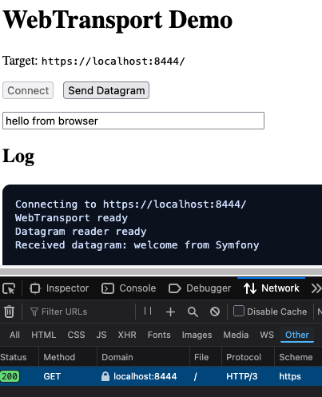

# Symfony HTTP3

This is a Symfony backend + Rust gateway scaffold setup where the gateway terminates TLS + HTTP/3 (QUIC) and speaks WebTransport directly (no Envoy/Caddy).

## Dev Setup
1. Clone (includes the Rust gateway submodule):
   ```bash
   git clone --recurse-submodules git@github.com:snoke/symfony-http3.git
   cd symfony-http3
   ```
2. Install mkcert
   ```bash
   brew install mkcert
   mkcert -install
   ```
3. Generate local certs:
   ```bash
   mkcert -cert-file gateway/certs/dev_cert.pem -key-file gateway/certs/dev_key.pem localhost 127.0.0.1 ::1
   ```
4. Start:
   ```bash
   docker compose up --build
   ```
5. Verify:
   - Open the demo UI: `http://localhost:8183/demo`
   - Click **Connect**
   - In DevTools → Network, you should see an **HTTP/3** session
   - The log should show: `Received datagram: welcome from Symfony`
     (sent from `symfony/src/EventSubscriber/GatewayEventSubscriber.php`, delivered via the gateway to the client over WebTransport/QUIC/HTTP‑3)
   
      Note: this will fail by default if your browser is not configured to support HTTP/3 - see [Browser Flags](#browser-flags) below)

      

## Browser Flags
### Chrome
1. Set flags in `chrome://flags` and relaunch:
   - `#webtransport-developer-mode`
   - `#enable-quic`
2. Restart Chrome.
### Firefox Nightly
1. Install NSS and trust the mkcert CA in Firefox:
   ```bash
   brew install nss
   mkcert -install
   ```
2. Set flags in `about:config`:
   - `network.webtransport.enabled = true`
   - `network.http.http3.enable = true`
   - `network.http.http3.disable_when_third_party_roots_found = false` (required for mkcert)
3. Restart Firefox.
